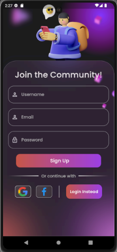

# Flutter Login Page (WinterHacks)

Welcome to the my WinterHacks submission for the Flutter task! This project is a Flutter application that provides a login page UI.

## Table of Contents
- [System Requirements](#system-requirements)
- [Application Structure](#application-structure)
---
## System Requirements

Before getting started, make sure you have the following software installed:

- Dart SDK Version 2.18.0 or greater
- Flutter SDK Version 3.3.0 or greater
---
## Application Structure

After a successful build, your application structure should look like this:

  

    
  

  

    
  

